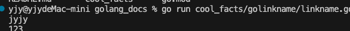

# Golinkname

# 简介
在golang中，函数都用首字母大写的方式决定是否能被其它的包引用（称为是否能导出）。 但是

# 具体实现

example 地址: https://github.com/yjy233/golang_docs/tree/dev_golinkname/cool_facts/golinkname

## 文件目录结构

```
.
├── golinkname.md
├── lib
│   └── lib.go
└── linkname.go
```
## 不能导出函数
在 lib/lib.go 中有一个 不能导出的函数 funcA
```
func funcA(a int) {
	fmt.Println(a)
}

```
函数的全部路径可以表示为 github.com/yjy233/golang_docs/cool_facts/golinkname/lib.funcA

如果我们这时候想在linkname.go里面使用funcA，就需要golinkname 出手了/
这里为了能使用这个函数我们这里处理

## import包

```
import (
	"fmt"
	_ "unsafe"

	_ "github.com/yjy233/golang_docs/cool_facts/golinkname/lib"
)
```
这里首先是要导入 _ “unsafe”,因为要使用golinkname就必须导入unsafe包

其次就是 "github.com/yjy233/golang_docs/cool_facts/golinkname/lib” 是要使用不能导出函数的包路径。

## 申明函数
因为go是鸭子类型语言，所以处理哲学如下：在包定义一个函数签名一样的函数并连接到想使用的函数。具体语法如下：
```
//go:linkname fA github.com/yjy233/golang_docs/cool_facts/golinkname/lib.funcA
func fA(a int)

```
***注意：这里必须采用这里的格式//go:linkname 现在函数名 不能导出函数的全局路径*** 

# 使用结果

命令如下
```
	go run cool_facts/golinkname/linkname.go
```


可见符合预期！